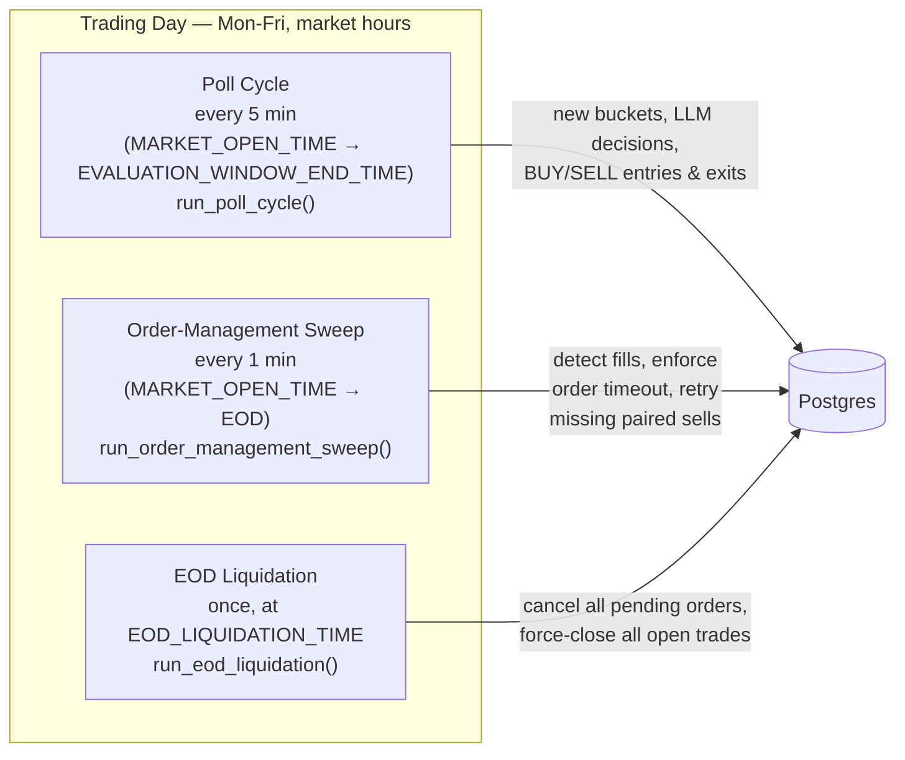
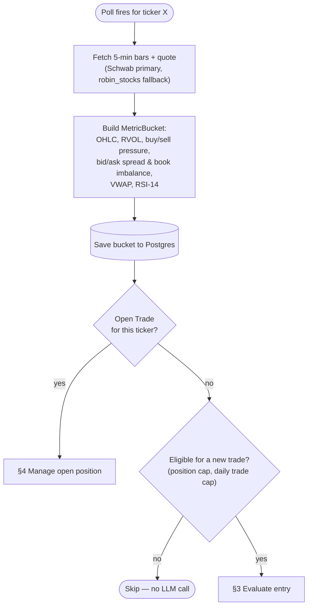
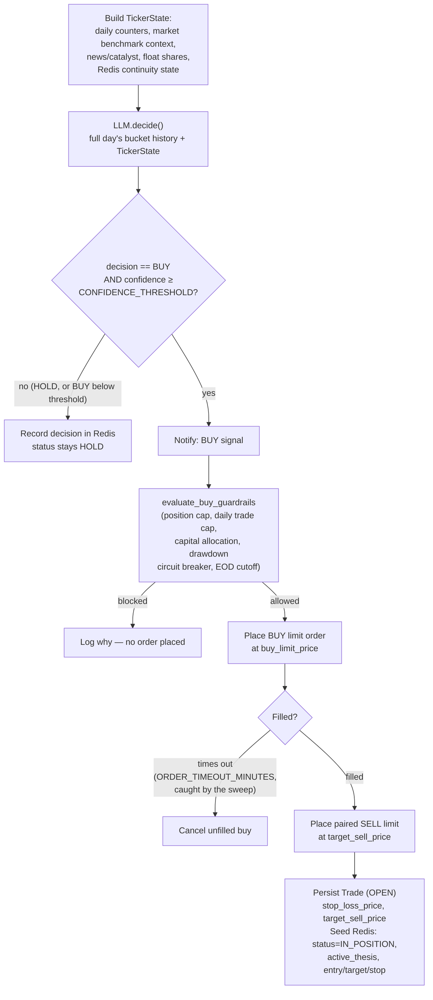
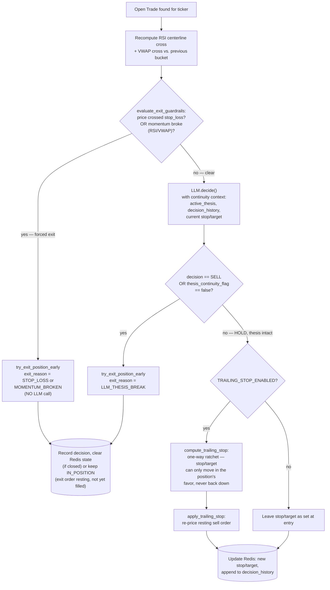
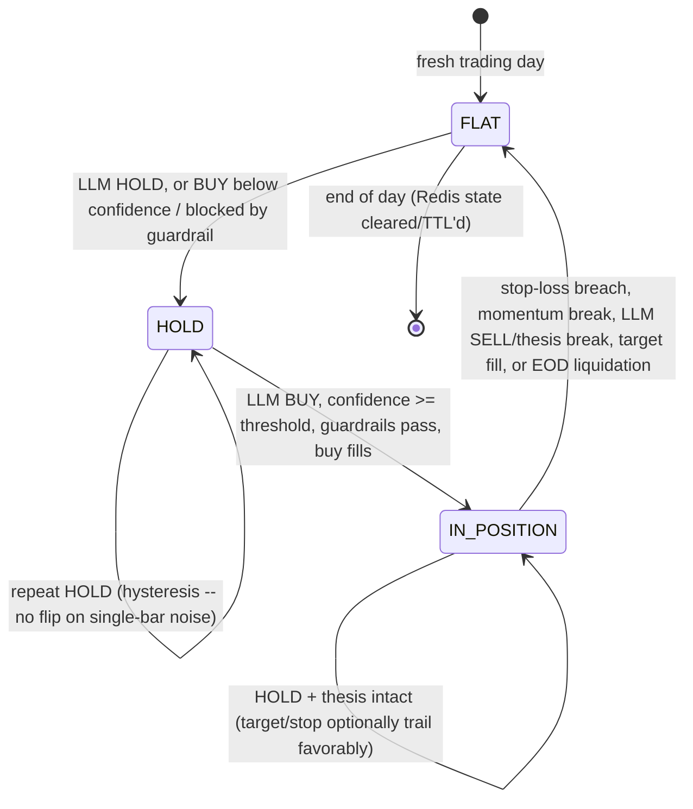
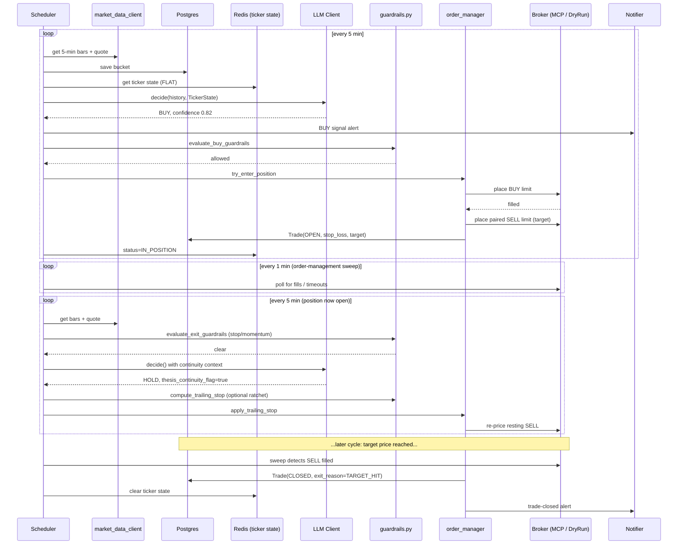

# Trading Workflow

This document walks through **what actually happens, in order**, from market open to end-of-day
liquidation — the runtime workflow, as opposed to [`docs/architecture.html`](architecture.html)'s static
system/component/deployment views. Start here if you're trying to understand *how a trade happens*
before diving into the code; see [`CLAUDE.md`](../CLAUDE.md) for the module-by-module tour and
[`requirements.md`](../requirements.md) for the authoritative spec each step below is implementing.

All diagrams are [Mermaid](https://mermaid.js.org/) and render natively on GitHub.

## Contents

- [1. The three scheduled jobs](#1-the-three-scheduled-jobs)
- [2. Per-cycle flow for one ticker](#2-per-cycle-flow-for-one-ticker)
- [3. Entering a position](#3-entering-a-position)
- [4. Managing an open position](#4-managing-an-open-position)
- [5. Ticker state machine](#5-ticker-state-machine)
- [6. End-to-end sequence for one round-trip trade](#6-end-to-end-sequence-for-one-round-trip-trade)
- [7. Guardrails reference](#7-guardrails-reference)
- [8. DRY_RUN / PAPER_TRADING / LIVE](#8-dry_run--paper_trading--live)

---

## 1. The three scheduled jobs

Everything is driven by three APScheduler cron jobs, wired in `scheduler.py`'s `build_scheduler`. They
run concurrently and independently — the poll cycle doesn't wait for the sweep, and vice versa.

* **Poll cycle** (`run_poll_cycle`) — the core decision loop. Fires every `POLL_INTERVAL_MINUTES`
  (default 5) across `EVALUATION_WINDOW`. This is where market data is captured, buckets are built, and
  the LLM is consulted.
* **Order-management sweep** (`run_order_management_sweep`) — fires every minute, independent of the
  5-minute bucket cadence, because fills and timeouts don't wait for the next poll. Detects buy/sell
  fills, cancels buy orders that have sat unfilled past `ORDER_TIMEOUT_MINUTES`, and retries a paired
  sell placement that failed after its buy filled.
* **EOD liquidation** (`run_eod_liquidation`) — fires once at `EOD_LIQUIDATION_TIME` (default 15:45
  local). Cancels every pending order and force-sells every still-open position at the current bid, so
  nothing carries overnight risk (spec §4, "No Overnight Exposure").

---

## 2. Per-cycle flow for one ticker

`run_poll_cycle` loops the watchlist and calls `_poll_ticker` for each symbol, isolated with its own
try/except so one bad ticker never blocks the rest. The first fork in the road is whether the ticker
already has an open position — that decides which of two very different paths (§3 vs §4 below) it takes.

Two guardrails are checked **before spending an LLM call**: `check_position_cap` (max concurrent open
positions per ticker, default 1 — spec's "Zero Concurrent Stacking") and `check_daily_trade_cap` (max
completed round-trips per ticker per day). If either blocks, the cycle skips the ticker entirely rather
than asking the LLM something it can't act on anyway.

---

## 3. Entering a position

The LLM call is **necessary but never sufficient** — `execution/guardrails.py`'s
`evaluate_buy_guardrails` is re-checked independently at the point of order submission (spec principle:
guardrails are invariants, not advisory). A BUY decision that clears the confidence threshold can still
be blocked here (e.g. the daily drawdown circuit breaker tripped between the LLM call and now).

`try_enter_position` (`execution/order_manager.py`) does the buy→paired-sell handoff. In `DRY_RUN`/
`PAPER_TRADING`, `DryRunBrokerClient` fills both legs instantly against the last-marked price, so a BUY
can open *and* close again within the same poll cycle — the code re-checks the actual DB state afterward
rather than assuming "opened" means "still holding."

---

## 4. Managing an open position

This is Phase 3's core addition: an open position is **actively re-evaluated every poll cycle**, not left
to passively wait on its resting sell order. Two layers run in order, and the first one needs no LLM call
at all.

The three invalidation criteria from spec §8 map to code as:

| # | Criterion | Enforcement |
|---|-----------|-------------|
| 1 | Price crosses stop-loss | Code-enforced, deterministic (`is_stop_loss_breached`) |
| 2 | Momentum alignment breaks (RSI centerline / VWAP) | Code-enforced, deterministic (`is_momentum_broken`) |
| 3 | Major negative catalyst headline | No sentiment classifier exists — judged entirely by the LLM via `thesis_continuity_flag` / a `SELL` decision |

Criteria 1–2 can force an exit **even against an LLM HOLD** — they're checked first, before any LLM call
that cycle, consistent with this codebase's guardrail philosophy that safety-critical checks are never
merely advisory.

---

## 5. Ticker state machine

Per-ticker working state (`state/ticker_state_store.py`, Redis, keyed by `(ticker, trade_date)`, TTL'd)
tracks the `status` field that both the prompt (for hysteresis) and `_manage_open_position` (to detect a
lost/expired Redis key mid-position) rely on.

Postgres's `Trade.stop_loss_price` remains the source of truth if Redis state is ever lost mid-position
(process restart, TTL surprise) — `scheduler.py` rebuilds the Redis working state from the `Trade` row
rather than treating an actually-open position as `FLAT`.

---

## 6. End-to-end sequence for one round-trip trade

A concrete walk-through, entry to exit, showing which component talks to which.

If none of that happens before `EOD_LIQUIDATION_TIME`, `run_eod_liquidation` force-closes the position at
the current bid regardless of LLM/guardrail state — this is the one path with no LLM involvement and no
opt-out.

---

## 7. Guardrails reference

All safety controls (spec §4) live in `execution/guardrails.py` as pure, dependency-free functions,
re-checked at the point of action rather than trusted from upstream state:

| Guardrail | Function | What it blocks / forces |
|---|---|---|
| Zero concurrent stacking | `check_position_cap` | A new BUY while a position is already open for that ticker (default cap: 1) |
| Daily trade cap | `check_daily_trade_cap` | A new BUY once the ticker has hit its max round-trips for the day |
| Capital allocation | `check_capital_allocation` | An order that would exceed the per-trade or aggregate daily dollar cap |
| Circuit breaker | `check_daily_drawdown_circuit_breaker` | Any new BUY once realized daily drawdown hits its limit |
| Order timeout | `is_order_timed_out` | An unfilled BUY limit order past `ORDER_TIMEOUT_MINUTES` — cancelled by the sweep |
| EOD cutoff | `is_past_liquidation_time` | Any new BUY after the liquidation cutoff |
| Stop-loss breach (exit-side) | `is_stop_loss_breached` (`invalidation.py`) | Forces an exit on an open position, even against an LLM HOLD |
| Momentum break (exit-side) | `is_momentum_broken` (`invalidation.py`) | Forces an exit on RSI-centerline or VWAP crossing against the position |

---

## 8. DRY_RUN / PAPER_TRADING / LIVE

The workflow above is **identical** across all three modes — there is no mode-specific branch in
`_poll_ticker` or `_manage_open_position`. The only two differences are:

1. Which `BrokerExecutionClient` `main.py` wires up: `LIVE` gets the real `McpBrokerClient` (talks to the
   Robinhood Trading MCP with real money); `DRY_RUN` and `PAPER_TRADING` both get `DryRunBrokerClient`,
   an in-memory simulator that fills orders against marked prices with zero network calls.
2. Which `TradingModeEnum` value gets stamped on the resulting `Order`/`Trade` rows, so the audit trail
   can tell them apart.

`DRY_RUN` → `PAPER_TRADING` → `LIVE` is the intended promotion path: `DRY_RUN` for local/dev testing
anytime, `PAPER_TRADING` for a capital-free rehearsal during real market hours, `LIVE` only once that
rehearsal looks right (see README's [Going live](../README.md#going-live)).
